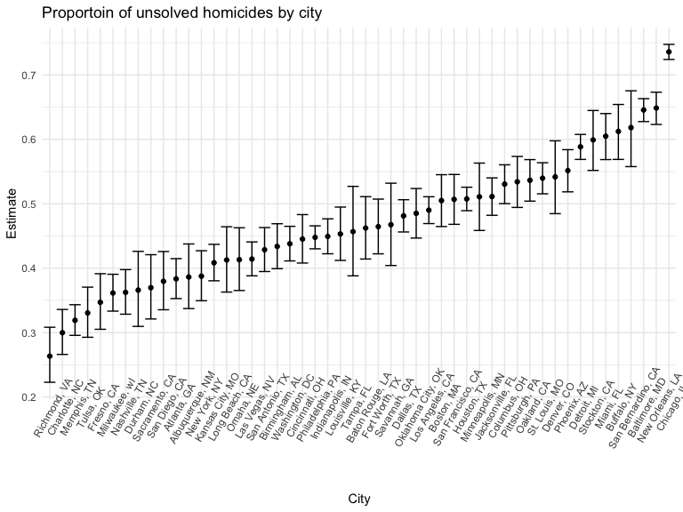
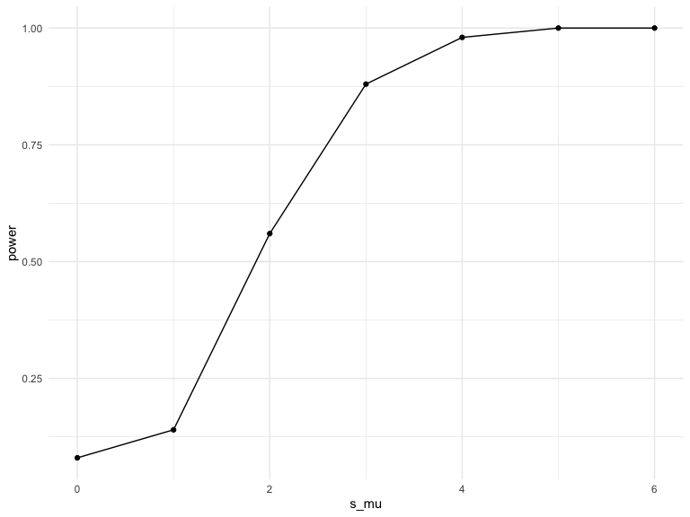
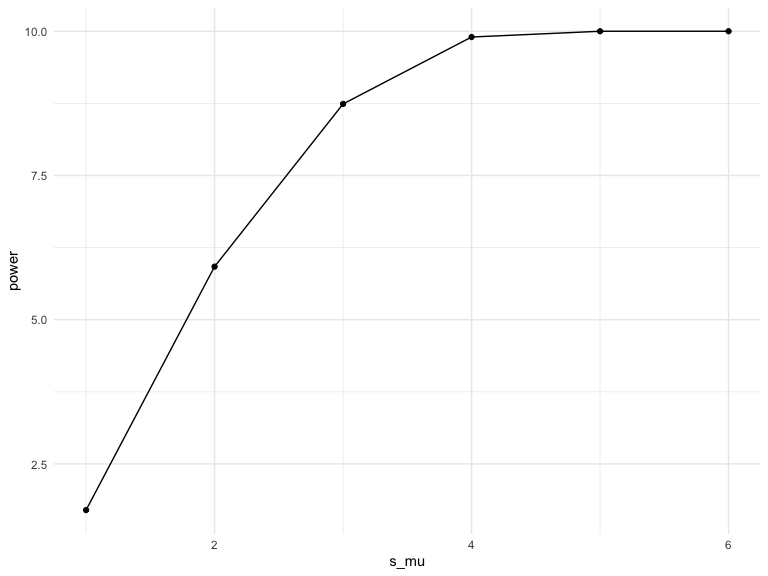
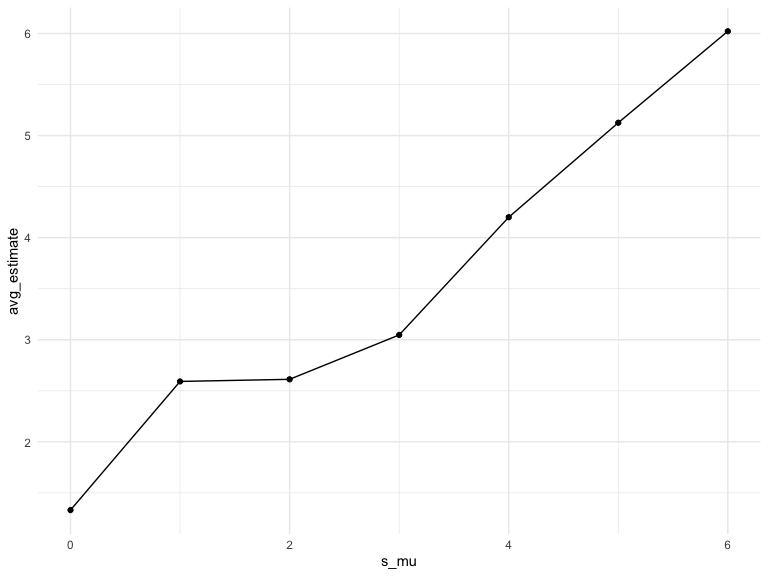

Homework 5
================
Jenesis Merriman
November 16, 2022

## Problem 2

This problem uses data gathered by the Washington Post on homicides
across the U.S. First, I will load the raw data and describe it.

``` r
homicides =
  read_csv("./data/homicide-data.csv") %>%
  janitor::clean_names()
```

    ## Rows: 52179 Columns: 12
    ## ── Column specification ────────────────────────────────────────────────────────
    ## Delimiter: ","
    ## chr (9): uid, victim_last, victim_first, victim_race, victim_age, victim_sex...
    ## dbl (3): reported_date, lat, lon
    ## 
    ## ℹ Use `spec()` to retrieve the full column specification for this data.
    ## ℹ Specify the column types or set `show_col_types = FALSE` to quiet this message.

**Description:** The homicides dataset displays data on homicides in 50
large cities across the U.S. This dataset contains 52179 rows and 12
columns, with each row representing a single reported homicide.
Variables provide information about the police report, the victim, and
the status of the investigation. Specifically, variables include: report
id, report date, victim last name, victim first name, victim race,
victim sex, victim age, city, state, latitude, longitude, and
disposition. In total, 26505 of the 52179 homicides in this dataset are
unsolved.

Next, I will tidy the data. The following code uses `mutate` to update
variables to appropriate types, convert reported_date into a more
readable format, correct the capitalization of victim_first and
victim_last names, and create a city_state variable that returns both
city and state (e.g. “Baltimore, MD”).

``` r
homicides =
  read_csv("./data/homicide-data.csv") %>%
  janitor::clean_names() %>%
  mutate(city_state = as.factor(str_c(city, state, sep = ", ")), #creates new variable
         reported_date = as.Date(as.character(reported_date),"%Y%m%d"), #date format
         victim_age = as.numeric(victim_age), #character to double
         victim_first = str_to_title(victim_first), #fixes all caps
         victim_last = str_to_title(victim_last), #fixes all caps
         victim_sex = as.factor(victim_sex), #character to factor
         victim_race = as.factor(victim_race), #character to factor
         city = as.factor(city), #character to factor
         state = as.factor(state), #character to factor
         city_state = recode(city_state, "Tulsa, AL" = "Tulsa, OK")) #CHECK DISC BOARD TO BE SURE OF THIS
```

    ## Rows: 52179 Columns: 12
    ## ── Column specification ────────────────────────────────────────────────────────
    ## Delimiter: ","
    ## chr (9): uid, victim_last, victim_first, victim_race, victim_age, victim_sex...
    ## dbl (3): reported_date, lat, lon
    ## 
    ## ℹ Use `spec()` to retrieve the full column specification for this data.
    ## ℹ Specify the column types or set `show_col_types = FALSE` to quiet this message.

Unsolved homicides are defined as homicides for which the disposition is
“Closed without arrest” or “Open/No arrest”. With the new variable
city_state, this code uses `group_by` and `summarize` to summarize
within cities and obtain the total number of homicides and the number of
unsolved homicides in each location.

``` r
city_homicides =
  homicides %>%
  group_by(city_state) %>%
  summarize(n_homicides = n(),
            n_unsolved = sum(disposition %in% c("Closed without arrest","Open/No arrest")))
```

Here, I will focus on the city of Baltimore, MD. The following code will
use the `prop.test` function to estimate the proportion of homicides
that are unsolved, save the output of `prop.test` as an R object, apply
the `broom::tidy` to this object, and pull the estimated proportion and
confidence intervals from the resulting tidy dataframe.

``` r
balt_test =
  city_homicides %>%
  filter(city_state == "Baltimore, MD") %>%
  mutate(p_test = map2(n_unsolved, n_homicides, ~ prop.test(.x, .y) %>%
                        broom::tidy())) %>% unnest()

balt_test %>% 
  select(city_state, estimate, "CI_lower" = conf.low, "CI_upper" = conf.high)
```

    ## # A tibble: 1 × 4
    ##   city_state    estimate CI_lower CI_upper
    ##   <fct>            <dbl>    <dbl>    <dbl>
    ## 1 Baltimore, MD    0.646    0.628    0.663

This next code chunk will use `purrr:map2` to apply `prop.test` to each
of the cities in the dataset, and `broom::tidy` and `unnest` to extract
the proportion of unsolved homicides and the confidence interval for
each. The result is a tidy dataframe with estimated proportions and CIs
for each city.

``` r
city_tests =
  city_homicides %>%
  mutate(p_test = map2(n_unsolved, n_homicides, ~ prop.test(.x, .y) %>%
                        broom::tidy())) %>% unnest() %>%
  select(city_state, estimate, "CI_lower" = conf.low, "CI_upper" = conf.high)
```

Finally, the following code uses `geom_point` and `geom_errorbar` to
create a plot showing the proportion estimates and confidence intervals
for each city. Cities are arranged in ascending order of proportion of
unsolved homicides.

``` r
city_tests %>%
  ggplot(aes(x = reorder(city_state, +estimate), y = estimate)) +
  geom_point(show.legend = FALSE) +
  geom_errorbar(aes(ymin = CI_lower, ymax = CI_upper)) +
  theme(axis.text.x = element_text(angle = 60)) +
  labs(
    title = "Proportoin of unsolved homicides by city",
    x = "City",
    y = "Estimate")
```



## Problem 3

When designing an experiment or analysis, a common question is whether
it is likely that a true effect will be detected – put differently,
whether a false null hypothesis will be rejected. The probability that a
false null hypothesis is rejected is referred to as power, and it
depends on several factors, including: the sample size; the effect size;
and the error variance. In this problem, you will conduct a simulation
to explore power in a one-sample t-test.

For this problem, I will generate 5000 datasets from the model
x∼Normal\[μ,σ\] and save the mean estimates and p-values (H:μ=0 using
α=0.05) for each. I will fix n=30, σ=5, and set μ=0. I will name μ as
“s_mu” (sample mean) so as not to be confused with the t-test function
input “mu”.

The following code creates a function to simulate data from a normal
distribution with the given sample size, mean, and standard deviation
values and conducts a one-sample t-test for each.

``` r
sim_mean_p = function(n = 30, s_mu, sigma = 5) {
  
  sim_data = tibble(
    x = rnorm(n, mean = s_mu, sd = sigma),
  )
  
  sim_data %>% 
    t.test(mu = 0, conf.level = 0.95) %>%
    broom::tidy() %>% unnest()
}
```

This code generates 5000 datasets and saves the mu hat and p-value for
each data set. The data frame “sim_df” contains all of these values.

``` r
sim_df = 
  rerun(50, sim_mean_p(s_mu = 0)) %>% #replace with n=5000
  bind_rows() %>% 
  select(estimate, p.value)
```

Repeat the above for μ={1,2,3,4,5,6}

``` r
sim_df_2 = 
  tibble(s_mu = c(0:6)) %>% 
  mutate(
    output_lists = map(.x = s_mu, ~rerun(50, sim_mean_p(s_mu = .x))), #replace with 5000
    estimate_dfs = map(output_lists, bind_rows)) %>% 
  select(-output_lists) %>% 
  unnest(estimate_dfs) %>%
  select(s_mu, estimate, p.value)
```

Complete the following: \*\* Make a plot showing the proportion of times
the null was rejected (the power of the test) on the y axis and the true
value of μ on the x axis. Describe the association between effect size
and power.

``` r
power_df = 
  sim_df_2 %>%
  mutate(decision = ifelse(p.value < 0.05, "reject", "fail_to_reject")) %>%
  group_by(s_mu, decision) %>%
  summarize(count = n()) %>%
  pivot_wider(names_from = decision, values_from = count) %>%
  mutate(power = reject / 50)
```

    ## `summarise()` has grouped output by 's_mu'. You can override using the
    ## `.groups` argument.

``` r
power_df %>%
  ggplot(aes(x = s_mu, y = power)) + 
  geom_point() + geom_line()
```



\*\* Make a plot showing the average estimate of μ̂ on the y axis and the
true value of μ on the x axis. Make a second plot (or overlay on the
first) the average estimate of μ̂ only in samples for which the null was
rejected on the y axis and the true value of μ on the x axis. Is the
sample average of μ̂ across tests for which the null is rejected
approximately equal to the true value of μ? Why or why not?

``` r
sim_df_2 %>%
  group_by(s_mu) %>%
  summarize(avg_estimate = mean(estimate)) %>%
  ggplot(aes(x = s_mu, y = avg_estimate)) +
  geom_point() + geom_line()
```



``` r
sim_df_2 %>%
  filter(p.value < 0.05) %>%
  group_by(s_mu) %>%
  summarize(avg_estimate = mean(estimate)) %>%
  ggplot(aes(x = s_mu, y = avg_estimate)) +
  geom_point() + geom_line()
```


