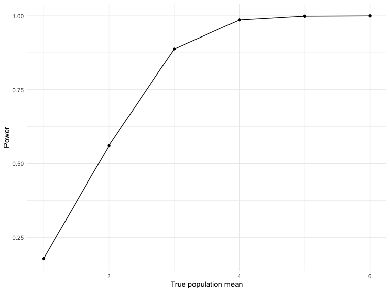

Homework 5
================
Jenesis Merriman
November 16, 2022

## Problem 1

The text and code for problem 1 comes from the solutions posted on the
course website:

The code chunk below imports the data in individual spreadsheets
contained in `./data/zip_data/`. To do this, I create a dataframe that
includes the list of all files in that directory and the complete path
to each file. As a next step, I `map` over paths and import data using
the `read_csv` function. Finally, I `unnest` the result of `map`.

``` r
full_df = 
  tibble(
    files = list.files("data/zip_data/"),
    path = str_c("data/zip_data/", files)
  ) %>% 
  mutate(data = map(path, read_csv)) %>% 
  unnest()
```

    ## Rows: 1 Columns: 8
    ## ── Column specification ────────────────────────────────────────────────────────
    ## Delimiter: ","
    ## dbl (8): week_1, week_2, week_3, week_4, week_5, week_6, week_7, week_8
    ## 
    ## ℹ Use `spec()` to retrieve the full column specification for this data.
    ## ℹ Specify the column types or set `show_col_types = FALSE` to quiet this message.
    ## Rows: 1 Columns: 8
    ## ── Column specification ────────────────────────────────────────────────────────
    ## Delimiter: ","
    ## dbl (8): week_1, week_2, week_3, week_4, week_5, week_6, week_7, week_8
    ## 
    ## ℹ Use `spec()` to retrieve the full column specification for this data.
    ## ℹ Specify the column types or set `show_col_types = FALSE` to quiet this message.
    ## Rows: 1 Columns: 8
    ## ── Column specification ────────────────────────────────────────────────────────
    ## Delimiter: ","
    ## dbl (8): week_1, week_2, week_3, week_4, week_5, week_6, week_7, week_8
    ## 
    ## ℹ Use `spec()` to retrieve the full column specification for this data.
    ## ℹ Specify the column types or set `show_col_types = FALSE` to quiet this message.
    ## Rows: 1 Columns: 8
    ## ── Column specification ────────────────────────────────────────────────────────
    ## Delimiter: ","
    ## dbl (8): week_1, week_2, week_3, week_4, week_5, week_6, week_7, week_8
    ## 
    ## ℹ Use `spec()` to retrieve the full column specification for this data.
    ## ℹ Specify the column types or set `show_col_types = FALSE` to quiet this message.
    ## Rows: 1 Columns: 8
    ## ── Column specification ────────────────────────────────────────────────────────
    ## Delimiter: ","
    ## dbl (8): week_1, week_2, week_3, week_4, week_5, week_6, week_7, week_8
    ## 
    ## ℹ Use `spec()` to retrieve the full column specification for this data.
    ## ℹ Specify the column types or set `show_col_types = FALSE` to quiet this message.
    ## Rows: 1 Columns: 8
    ## ── Column specification ────────────────────────────────────────────────────────
    ## Delimiter: ","
    ## dbl (8): week_1, week_2, week_3, week_4, week_5, week_6, week_7, week_8
    ## 
    ## ℹ Use `spec()` to retrieve the full column specification for this data.
    ## ℹ Specify the column types or set `show_col_types = FALSE` to quiet this message.
    ## Rows: 1 Columns: 8
    ## ── Column specification ────────────────────────────────────────────────────────
    ## Delimiter: ","
    ## dbl (8): week_1, week_2, week_3, week_4, week_5, week_6, week_7, week_8
    ## 
    ## ℹ Use `spec()` to retrieve the full column specification for this data.
    ## ℹ Specify the column types or set `show_col_types = FALSE` to quiet this message.
    ## Rows: 1 Columns: 8
    ## ── Column specification ────────────────────────────────────────────────────────
    ## Delimiter: ","
    ## dbl (8): week_1, week_2, week_3, week_4, week_5, week_6, week_7, week_8
    ## 
    ## ℹ Use `spec()` to retrieve the full column specification for this data.
    ## ℹ Specify the column types or set `show_col_types = FALSE` to quiet this message.
    ## Rows: 1 Columns: 8
    ## ── Column specification ────────────────────────────────────────────────────────
    ## Delimiter: ","
    ## dbl (8): week_1, week_2, week_3, week_4, week_5, week_6, week_7, week_8
    ## 
    ## ℹ Use `spec()` to retrieve the full column specification for this data.
    ## ℹ Specify the column types or set `show_col_types = FALSE` to quiet this message.
    ## Rows: 1 Columns: 8
    ## ── Column specification ────────────────────────────────────────────────────────
    ## Delimiter: ","
    ## dbl (8): week_1, week_2, week_3, week_4, week_5, week_6, week_7, week_8
    ## 
    ## ℹ Use `spec()` to retrieve the full column specification for this data.
    ## ℹ Specify the column types or set `show_col_types = FALSE` to quiet this message.
    ## Rows: 1 Columns: 8
    ## ── Column specification ────────────────────────────────────────────────────────
    ## Delimiter: ","
    ## dbl (8): week_1, week_2, week_3, week_4, week_5, week_6, week_7, week_8
    ## 
    ## ℹ Use `spec()` to retrieve the full column specification for this data.
    ## ℹ Specify the column types or set `show_col_types = FALSE` to quiet this message.
    ## Rows: 1 Columns: 8
    ## ── Column specification ────────────────────────────────────────────────────────
    ## Delimiter: ","
    ## dbl (8): week_1, week_2, week_3, week_4, week_5, week_6, week_7, week_8
    ## 
    ## ℹ Use `spec()` to retrieve the full column specification for this data.
    ## ℹ Specify the column types or set `show_col_types = FALSE` to quiet this message.
    ## Rows: 1 Columns: 8
    ## ── Column specification ────────────────────────────────────────────────────────
    ## Delimiter: ","
    ## dbl (8): week_1, week_2, week_3, week_4, week_5, week_6, week_7, week_8
    ## 
    ## ℹ Use `spec()` to retrieve the full column specification for this data.
    ## ℹ Specify the column types or set `show_col_types = FALSE` to quiet this message.
    ## Rows: 1 Columns: 8
    ## ── Column specification ────────────────────────────────────────────────────────
    ## Delimiter: ","
    ## dbl (8): week_1, week_2, week_3, week_4, week_5, week_6, week_7, week_8
    ## 
    ## ℹ Use `spec()` to retrieve the full column specification for this data.
    ## ℹ Specify the column types or set `show_col_types = FALSE` to quiet this message.
    ## Rows: 1 Columns: 8
    ## ── Column specification ────────────────────────────────────────────────────────
    ## Delimiter: ","
    ## dbl (8): week_1, week_2, week_3, week_4, week_5, week_6, week_7, week_8
    ## 
    ## ℹ Use `spec()` to retrieve the full column specification for this data.
    ## ℹ Specify the column types or set `show_col_types = FALSE` to quiet this message.
    ## Rows: 1 Columns: 8
    ## ── Column specification ────────────────────────────────────────────────────────
    ## Delimiter: ","
    ## dbl (8): week_1, week_2, week_3, week_4, week_5, week_6, week_7, week_8
    ## 
    ## ℹ Use `spec()` to retrieve the full column specification for this data.
    ## ℹ Specify the column types or set `show_col_types = FALSE` to quiet this message.
    ## Rows: 1 Columns: 8
    ## ── Column specification ────────────────────────────────────────────────────────
    ## Delimiter: ","
    ## dbl (8): week_1, week_2, week_3, week_4, week_5, week_6, week_7, week_8
    ## 
    ## ℹ Use `spec()` to retrieve the full column specification for this data.
    ## ℹ Specify the column types or set `show_col_types = FALSE` to quiet this message.
    ## Rows: 1 Columns: 8
    ## ── Column specification ────────────────────────────────────────────────────────
    ## Delimiter: ","
    ## dbl (8): week_1, week_2, week_3, week_4, week_5, week_6, week_7, week_8
    ## 
    ## ℹ Use `spec()` to retrieve the full column specification for this data.
    ## ℹ Specify the column types or set `show_col_types = FALSE` to quiet this message.
    ## Rows: 1 Columns: 8
    ## ── Column specification ────────────────────────────────────────────────────────
    ## Delimiter: ","
    ## dbl (8): week_1, week_2, week_3, week_4, week_5, week_6, week_7, week_8
    ## 
    ## ℹ Use `spec()` to retrieve the full column specification for this data.
    ## ℹ Specify the column types or set `show_col_types = FALSE` to quiet this message.
    ## Rows: 1 Columns: 8
    ## ── Column specification ────────────────────────────────────────────────────────
    ## Delimiter: ","
    ## dbl (8): week_1, week_2, week_3, week_4, week_5, week_6, week_7, week_8
    ## 
    ## ℹ Use `spec()` to retrieve the full column specification for this data.
    ## ℹ Specify the column types or set `show_col_types = FALSE` to quiet this message.

The code chunk below tides the data using string manipulations on the
file, converting from wide to long, and selecting relevant variables.

``` r
tidy_df = 
  full_df %>% 
  mutate(
    files = str_replace(files, ".csv", ""),
    group = str_sub(files, 1, 3)) %>% 
  pivot_longer(
    week_1:week_8,
    names_to = "week",
    values_to = "outcome",
    names_prefix = "week_") %>% 
  mutate(week = as.numeric(week)) %>% 
  select(group, subj = files, week, outcome)
```

Finally, the code chunk below creates a plot showing individual data,
faceted by group.

``` r
tidy_df %>% 
  ggplot(aes(x = week, y = outcome, group = subj, color = group)) + 
  geom_point() + 
  geom_path() + 
  facet_grid(~group)
```


This plot suggests high within-subject correlation – subjects who start
above average end up above average, and those that start below average
end up below average. Subjects in the control group generally don’t
change over time, but those in the experiment group increase their
outcome in a roughly linear way.

## Problem 2

This problem uses data gathered by the Washington Post on homicides
across the U.S. First, I will load the raw data and describe it.

``` r
homicides =
  read_csv("./data/homicide-data.csv")
```

    ## Rows: 52179 Columns: 12
    ## ── Column specification ────────────────────────────────────────────────────────
    ## Delimiter: ","
    ## chr (9): uid, victim_last, victim_first, victim_race, victim_age, victim_sex...
    ## dbl (3): reported_date, lat, lon
    ## 
    ## ℹ Use `spec()` to retrieve the full column specification for this data.
    ## ℹ Specify the column types or set `show_col_types = FALSE` to quiet this message.

**Description:** The homicides dataset displays data on homicides in 50
large cities across the U.S. This dataset contains 52179 rows and 12
columns, with each row representing a single reported homicide.
Variables provide information about the police report, the victim, and
the status of the investigation. Specifically, variables include: report
id, report date, victim last name, victim first name, victim race,
victim sex, victim age, city, state, latitude, longitude, and
disposition. In total, 26505 of the 52179 homicides in this dataset are
unsolved.

Next, I will tidy the data. The following code uses `mutate` to update
variables to appropriate types, convert reported_date into a more
readable format (YYY-MM-DD), correct the capitalization of victim_first
and victim_last names, and create a city_state variable that returns
both city and state (e.g. “Baltimore, MD”). It also fixes one
observation incorrectly noted as occurring in “Tulsa, AL,” using
`mutate` and `case_when` to update this to “Tulsa, OK” since there is no
Tulsa in Alabama.

``` r
homicides =
  homicides %>%
  janitor::clean_names() %>%
  mutate(state = case_when(state == "AL" & city == "Tulsa" ~ "OK", TRUE ~ state),
         city_state = as.factor(str_c(city, state, sep = ", ")), #creates new variable
         reported_date = as.Date(as.character(reported_date),"%Y%m%d"), #date format
         victim_age = as.numeric(victim_age), #character to double
         victim_first = str_to_title(victim_first), #fixes all caps
         victim_last = str_to_title(victim_last), #fixes all caps
         victim_sex = as.factor(victim_sex), #character to factor
         victim_race = as.factor(victim_race), #character to factor
         city = as.factor(city), #character to factor
         state = as.factor(state)) #character to factor
```

Unsolved homicides are defined as homicides for which the disposition is
“Closed without arrest” or “Open/No arrest”. Using the new variable
city_state, this code uses `group_by` and `summarize` to summarize
within cities and obtain the total number of homicides and the number of
unsolved homicides in each location.

``` r
city_homicides =
  homicides %>%
  group_by(city_state) %>%
  summarize(n_homicides = n(),
            n_unsolved = sum(disposition %in% c("Closed without arrest","Open/No arrest")))
```

Here, I will focus on the city of Baltimore, MD. The following code will
use the `prop.test` function to estimate the proportion of homicides
that are unsolved, save the output of `prop.test` as an R object, apply
the `broom::tidy` to this object, and pull the estimated proportion and
confidence intervals from the resulting tidy dataframe.

``` r
balt_test =
  city_homicides %>%
  filter(city_state == "Baltimore, MD") %>%
  mutate(p_test = map2(n_unsolved, n_homicides, ~ prop.test(.x, .y) %>%
                        broom::tidy())) %>% unnest()

balt_test %>% 
  select(city_state, estimate, "CI_lower" = conf.low, "CI_upper" = conf.high)
```

    ## # A tibble: 1 × 4
    ##   city_state    estimate CI_lower CI_upper
    ##   <fct>            <dbl>    <dbl>    <dbl>
    ## 1 Baltimore, MD    0.646    0.628    0.663

This next code chunk will use `purrr:map2` to apply `prop.test` to each
of the cities in the dataset, and `broom::tidy` and `unnest` to extract
the proportion of unsolved homicides and the confidence interval for
each. The result is a tidy dataframe with estimated proportions and CIs
for each city.

``` r
city_tests =
  city_homicides %>%
  mutate(p_test = map2(n_unsolved, n_homicides, ~ prop.test(.x, .y) %>%
                        broom::tidy())) %>% unnest() %>%
  select(city_state, estimate, "CI_lower" = conf.low, "CI_upper" = conf.high)

city_tests
```

    ## # A tibble: 50 × 4
    ##    city_state      estimate CI_lower CI_upper
    ##    <fct>              <dbl>    <dbl>    <dbl>
    ##  1 Albuquerque, NM    0.386    0.337    0.438
    ##  2 Atlanta, GA        0.383    0.353    0.415
    ##  3 Baltimore, MD      0.646    0.628    0.663
    ##  4 Baton Rouge, LA    0.462    0.414    0.511
    ##  5 Birmingham, AL     0.434    0.399    0.469
    ##  6 Boston, MA         0.505    0.465    0.545
    ##  7 Buffalo, NY        0.612    0.569    0.654
    ##  8 Charlotte, NC      0.300    0.266    0.336
    ##  9 Chicago, IL        0.736    0.724    0.747
    ## 10 Cincinnati, OH     0.445    0.408    0.483
    ## # … with 40 more rows

### Plots

Finally, the following code uses `geom_point` and `geom_errorbar` to
create a plot showing the proportion estimates and confidence intervals
for each city. Cities are arranged in ascending order of proportion of
unsolved homicides.

``` r
city_tests %>%
  ggplot(aes(x = reorder(city_state, +estimate), y = estimate)) +
  geom_point(show.legend = FALSE) +
  geom_errorbar(aes(ymin = CI_lower, ymax = CI_upper)) +
  theme(axis.text.x = element_text(angle = 90)) +
  labs(
    title = "Proportion of unsolved homicides by city",
    x = "City",
    y = "Estimate")
```


## Problem 3

When designing an experiment or analysis, a common question is whether
it is likely that a true effect will be detected – put differently,
whether a false null hypothesis will be rejected. The probability that a
false null hypothesis is rejected is referred to as power, and it
depends on several factors, including: the sample size; the effect size;
and the error variance. In this problem, I will conduct a simulation to
explore power in a one-sample t-test.

First, I will generate 5000 datasets from the model x ∼ Normal \[ μ , σ
\] and save the mean estimates and p-values ( H : μ = 0 at α = 0.05 )
for each. I will fix n = 30, σ = 5, and set μ = 0. I will name μ as
“s_mu” so as not to be confused with the `t.test` function input “mu”.

The following code creates a function to simulate data from a normal
distribution with the given sample size, mean, and standard deviation
values and conducts a one-sample t-test for each, with the null
hypothesis H : μ = 0 at α = 0.05.

``` r
sim_mean_p = function(n = 30, s_mu, sigma = 5) {
  
  sim_data = tibble(
    x = rnorm(n, mean = s_mu, sd = sigma),
  )
  
  sim_data %>% 
    t.test(mu = 0, conf.level = 0.95) %>%
    broom::tidy() %>% unnest()
}
```

This code generates 5000 datasets given μ = 0, maps my function
`sim_mean_p` on each dataset, and saves the mean estimate and p-value
for each. The resulting data frame “sim_df_0” contains estimates and
p-values for each of these datasets.

``` r
sim_df_0 = 
  rerun(500, sim_mean_p(s_mu = 0)) %>% #replace with n=5000
  bind_rows() %>% 
  select(estimate, p.value)
```

The following code repeats the above for μ = {1,2,3,4,5,6} and saves all
estimates and p-values to the resulting data frame “sim_df_2.”

``` r
sim_df_1 = 
  tibble(s_mu = c(1:6)) %>% 
  mutate(
    output_lists = map(.x = s_mu, ~rerun(500, sim_mean_p(s_mu = .x))), #replace with 5000
    estimate_dfs = map(output_lists, bind_rows)) %>% 
  select(-output_lists) %>% 
  unnest(estimate_dfs) %>%
  select(s_mu, estimate, p.value)
```

### Plots

The following code creates a plot showing the proportion of times the
null was rejected (the power of the test) on the y axis and the true
value of μ on the x axis.

``` r
power_df = 
  sim_df_1 %>%
  mutate(decision = ifelse(p.value < 0.05, "reject", "fail_to_reject")) %>%
  group_by(s_mu, decision) %>%
  summarize(count = n()) %>%
  pivot_wider(names_from = decision, values_from = count) %>%
  mutate(power = reject / 500)
```

    ## `summarise()` has grouped output by 's_mu'. You can override using the
    ## `.groups` argument.

``` r
power_df %>%
  ggplot(aes(x = s_mu, y = power)) + 
  geom_point() + geom_line() +
  labs(
    x = "True mean",
    y = "Power")
```


**Description:** This power curve shows a positive association between
effect size and power. As the effect size – the extent of the departure
from the null (μ=0) – increases, power increases. In other words, as μ
increases from 0, so does our power. When power reaches 1.0 (μ=5 in our
plot), the curve flattens since 1 is the maximum value for power.

This next code chunk creates a plot showing i) the average estimate of μ̂
on the y axis and the true value of μ on the x axis and ii) the average
estimate of μ̂ on the y axis and the true value of μ on the x axis only
for samples for which the null was rejected .

``` r
plot_i =
  sim_df_1 %>%
  group_by(s_mu) %>%
  summarize(avg_estimate = mean(estimate)) %>%
  mutate(type = "all")

plot_ii =
  sim_df_1 %>%
  filter(p.value < 0.05) %>%
  group_by(s_mu) %>%
  summarize(avg_estimate = mean(estimate)) %>%
  mutate(type = "null rejected")

plot_iii = bind_rows(plot_i, plot_ii)

plot_iii %>%
  ggplot(aes(x = s_mu, y = avg_estimate, color = type, alpha = 0.5)) +
  geom_point() + geom_line() +
  guides(alpha = "none", size = "none") +
  labs(
    x = "True population mean",
    y = "Mean estimate")
```


**Is the sample average of μ̂ across tests for which the null is rejected
approximately equal to the true value of μ? Why or why not?**

This plot shows that the sample average of μ̂across tests for which the
null is rejected is only approximately equal to the true value of μ when
the true μ is greater than 3. As the true population mean increases, the
sample average across tests for which the null is rejected gets closer
to the true population mean. This is because power increases with effect
size.
